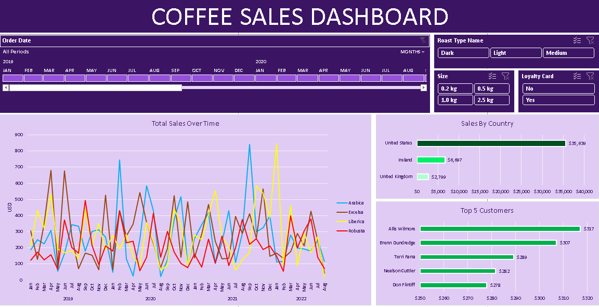

# Coffee Sales Portfolio Project

# [Project 1: Coffee Sales Data Analysis](https://akedataanalyst.github.io/microsoft_excel_portfolio_proj01-/) 

## Project Overview
These project focuses on creating a dynamic interactive coffee sales dashboard using Excel. It involves gathering data, transforming data, and utilizing pivot tables and charts to visualize sales data.

### 1. Data Gathering 
- Orders Tab: Contains order ID, order date, customer ID, product ID, and quantity. Additional data will be populated using lookup functions
- Customer Table: Includes customer information with customer ID as the primary key
- Products Table: Contains product ID, coffee type, roast type, unit price, and profit

[Microsoft Excel Project file](https://github.com/akeDataAnalyst/microsoft_excel_portfolio_proj01-/blob/main/coffeeOrdersProject.xlsx)
  
### 2. Excel Functions Used 
- XLOOKUP: Used for gathering customer data based on customer ID
- INDEX-MATCH: A dynamic formula for retrieving product information based on product ID and coffee type
- IF Function: Used to convert coffee type abbreviations to full names

### 3. Data Formatting 
- Dates formatted to show Day, Month(abbreviated), and Year
- Sizes of coffee packages formatted to include metric units (kilos)
- Currency formatting applied to unit price and sales columns

### 4. Pivot Tables and Charts
Pivot tables are created to analyze total sales and visualize data effectively. The process includes selecting the appropriate data range and grouping by date

### 5. Dashboard Components
- Line Chart: Displays total sales over time, categorized by coffee type (Arabica, Excelsa, Liberica, Robusta)
- Bar Charts: Show sales by country (U.S., Ireland, UK) and the top five customers
- Slicers: Include filters for roast type, size of coffee packages, and customer loyalty card status

### Coffee Sales dashboard

# Thank You for Your Time!

